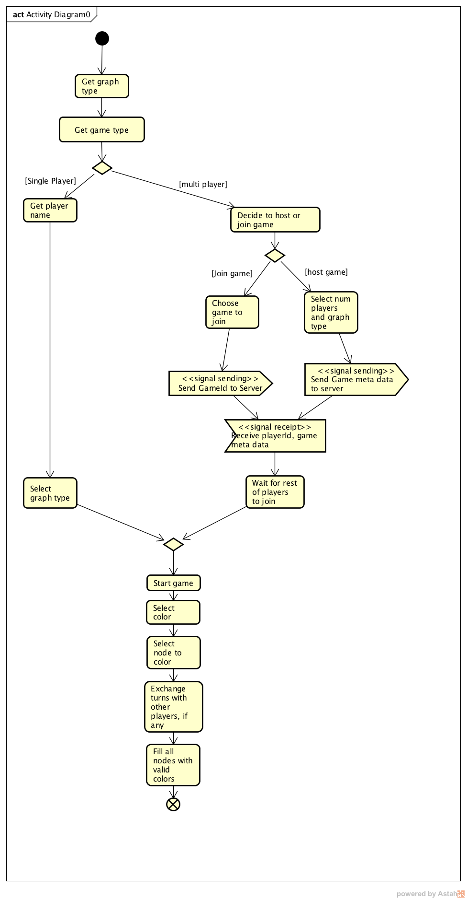

# UML Documentation
This folder contains UML documentation for project structure. 

## User Stories - Kelly Alvarez Aguirre
The below section contains a list of user stories describing our graph game functionality.

**USER:**

> As a user, I want to be able to launch the game so I can play it.

> As a user, I want to be able to decide between single player or multiplayer on my screen, so I can launch the game of my choice.

> As a user, I want to be able to select the single player option so that I can play on my own. 

> As a user, I want to be able to select the multiplayer option so that I can play with my friends.

**SINGLE PLAYER:**

> As a single player, I want to be able to have a list of available graphs, so I can pick one to play.

**MULTIPLAYER:**

> As a multiplayer user, I want to see the options available for multiplayer so I can make my decision.

> As a multiplayer user, I want to be able to host a game so that other users can join my session.

> As a multiplayer user, I want to be able to join an existing game so that I can play with other people

> As a non-host player, I want to be able to see the list of available game sessions so I can join one of my choice.

> As a non-host player, I want to be able to see the information for each game so I can know the gaming that I am joining

> As a multiplayer user, I want to be notify in my screen each player’s turn so I can know when it is mine turn.

> As a multiplayer user, I want to be able to see the moves from the other player(s) in my session so I can see the progress of the game.

**PLAYER:**

> As a player, I want to be able to see the graph that I have selected on my screen, so I can start playing

> As a player, I want to have a palette of colors so I can pick one to color a country on the graph 

> As a player, I want to be able to check what color I am selecting so I can pick between the palette

> As a player, I want to be able to switch between colors so I can play the game by the rules 

> As a player, I want to be able to color a country when I clicked on it, so I can complete the game 

> As a player, I want to be notified when the color of the country is valid or invalid so I can pick other color if wrong

> As a player, I want to be able to color all countries on the graph so I can complete the game 

> As a player, I want to be notified that the game has been completed, so I can see the results

> As a player, I want to see the timing results at the end of the game, so that I can see in how much time the game has been completed

## Activity Diagram - Jonathan Guan

The below activity diagram displays the user flow and interactions between the game and other players.
The diagram displays flows for both single player and multiplayer.

## Design Patterns

### Proxy
* GraphClient implements IServerProxy with the methods `send(String payload)` and `setDelegate(IServerCallbackDelegate delegate)`  

### Observer
* BaseGraph is the observer for the server GraphServer, and implements IServerCallbackDelegate method `receiveMove(String move)`

### Iterator / Composite
* GraphGameMonitor implements the iterator pattern by iterating through a composite list of threads spawned by GraphGameServer.
