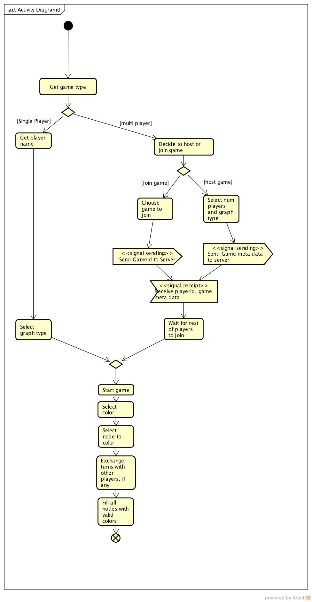

# UML Documentation
This folder contains UML documentation for project structure. 

## Activity Diagram - Jonathan Guan

The below activity diagram displays the user flow and interactions between the game and other players.
The diagram displays flows for both single player and multiplayer.

## Design Patterns

### Proxy
* GraphClient implements IServerProxy with the methods `send(String payload)` and `setDelegate(IServerCallbackDelegate delegate)`  

### Observer
* BaseGraph is the observer for the server GraphServer, and implements IServerCallbackDelegate method `receiveMove(String move)`

### Iterator / Composite
* GraphGameMonitor implements the iterator pattern by iterating through a composite list of threads spawned by GraphGameServer.
